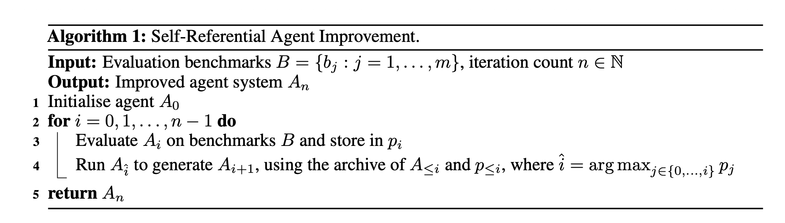
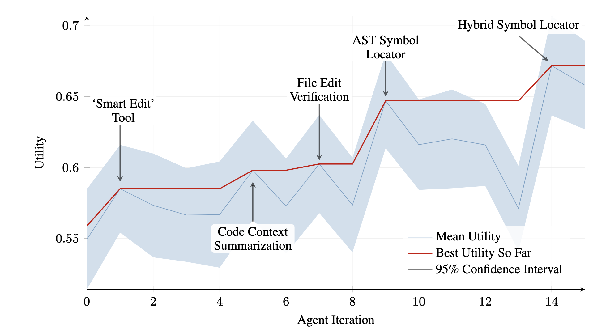
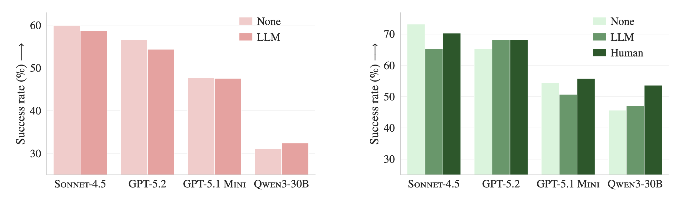

# RTSE Presentation

- talk about limitations, failures, how the method is broken
    - be critical of the paper
    - find limitations that they did not talk about
    - the authors wanted to pass peer review
    - if a paper is bad do not hesitate to bash it
- measure time presenting make sure its between 25-30min
    - go into depth on method
- only 1 thing per slide
- litter slides with examples

**Have a fun live demo that runs on the slides while I talk.**

- come up with ideas of how to visualize this
- have an agent do a little minigame or smth.

## Notes from meeting:

- first self improving agent
- include follow up / future work
    - find a usuful agent
    - openclaw
    - claude code
    - agents.md
- its maybe not clear that more context is worse maybe use several papers to support this (good context might help)
- are they overfitting to the dataset/benchmark? — discuss in class
    - test time learning

## Notes

published 16.05.2025

TITLE: first self improving (strikethrough) healing agent

used benchmarks LiveCodeBench, SWE Bench verified and syntheticially generated benchmarks

no weight updates

not super intersting compared to systems recently released like openclaw or codex

- they reference sonnet 3.5, gemini 2 and gpt o1
    - add benchmark comparisson to current models
- SWEBench — Take Github issue, generate patch and compare against correct patch
    - make one slide
- LiveCodeBench — Leetcode style questions — compare against real user solutions
    - make one slide

tree of thought: [https://arxiv.org/pdf/2305.10601](https://arxiv.org/pdf/2305.10601)

STaR: [https://arxiv.org/pdf/2203.14465](https://arxiv.org/pdf/2203.14465) — Self taught reasoner

different prompting strategies have a big impact: [https://arxiv.org/pdf/2406.06608](https://arxiv.org/pdf/2406.06608)

ADAS — automated design of agentic Systems:  [https://arxiv.org/pdf/2408.08435](https://arxiv.org/pdf/2408.08435)

- there is a meta agent that improves a task agent but the meta agent stays constant
- Idea: if the meta agent also self improves, improvements are compounding
- the perfomance of agents hits a ceiling with the capabilities of the meta agent
- only evaluated on Science and Math not on general purpose coding

- alpha evolve:
    - start with baseline program
    - a test to test the program (baseline implementation)
    - objective (make faster)
    - matrix multiplication:
        - get base O(n^3) implementation
        - improve
        - use base implementation to test
        - after each iteration keep set best implementations and repeat
    - this is only feasible for highly structured problems where you have a reference implementation that can easily be evaluated

### Setup

- start with base code and benchmarks and self improve:
- SICA — Self Improving Coding Agent
- Why is a self improving agent a coding agent? beacuse agents are written in code
    - also if everything had an api a coding agent would actually be autonomous

- current systems were not self improving coding agents in the sense that they can perform arbitrary tasks (only Math, Science etc.)
- Archive of old Agents and their benchmark results
- take the best agent from the archive A. A looks through archive and suggest one improvement

- evaluate new agent on benchmarks with utility function
    - the cost is capped at 10USD and time at 300s

- **Starting Point:**
    - open/close files
    - overwrite files
    - execute bash command
    - simple calculator tool
    - submit benchmark tool
    - return a result from a subagent to the main agent
    - exiting from a subagent call
    - an archive analysis tool
- subagents
    - can be started by an existing agent and return a string
    - the main agent can run for up to one hour for a meta improvement step thus the subagents can carry out tasks without filling the context of the main agent with unneccessary detail
- overseer agent
    - this agent periodicially runs and looks at the main agent and all subagents to judge whether they are on track. it can send notifications to the agents to steer them back to their objective or cancel their run in serious cases
    - it runs every 30s

- the open files and directory tree is context bloat the agent could just run grep or ls or search using glob
- also the core prompt includes all open files and contents. this is also context bloat

### Sub-Agents:

IMO this is way to many tools.

(SRC:  base_agent/src/tools)

- main in base_agent/src/agents/implementations/main_orchestrator.py:77
    - submit_answer
    - open_files
    - close_files
    - view_directory
    - meta_improvement_reasoning_structure
    - meta_improvement_review_committee
    - plus auto-added early_exit, regenerate_context, complete
- software_developer in base_agent/src/agents/implementations/coder.py:86
    - calculate
    - view_directory
    - execute_command
    - ripgrep_search
    - open_files
    - close_files
    - overwrite_file
    - meta_improvement_review_committee
    - plus auto-added early_exit, regenerate_context, return_result, complete
- general_problem_solver in base_agent/src/agents/implementations/problem_solver.py:76
    - calculate
    - view_directory
    - execute_command
    - open_files
    - close_files
    - overwrite_file
    - ripgrep_search
    - meta_improvement_review_committee
    - plus auto-added early_exit, regenerate_context, return_result, complete
- archive_explorer in base_agent/src/agents/implementations/archive_explorer.py:73
    - view_directory
    - open_files
    - close_files
    - best_problems
    - worst_problems
    - compare_agent_iterations
    - plus auto-added early_exit, regenerate_context, return_result, complete
- meta_agent_design_reviewer in base_agent/src/agents/implementations/review_committee_member.py:52
    - view_directory
    - open_files
    - close_files
    - ripgrep_search
    - plus auto-added early_exit, regenerate_context, return_result, complete
- reasoning_agent in base_agent/src/agents/implementations/reasoner.py:70
    - no explicit tools
    - but still gets auto-added early_exit, regenerate_context, return_result, complete from the base class unless something overrides that behavior

It has long been clear that agents have worse performance with more tools. And they perform better if they can use bash/code to solve problems:  CodeAct (Apple) — https://arxiv.org/pdf/2402.01030

Claude Code only as ca. 10 tools

### Evaluation & Test

- SWEBench Verified, LiveCodeBench and synthetic
    - Synthetic:
        - file_editing: Given a real repo at a pre-change commit and the desired target file contents, edit the file so it exactly matches the target version.(src:  base_agent/src/benchmarks/file_editing.py:397)
        - symbol_location: Given a symbol usage in a real repo, find and return the exact file, line, and column where that symbol is defined. (src: base_agent/src/benchmarks/symbol_location.py:233)
- They use Sonnet 3.5 for everything except for reasoning agent which uses o3 mini
- Cost for 15 iterations ca. 7000USD
- Promising improvements but in Anthropic’s on run of Claude Sonnet 3.5 on SWEBench Verified sonnet scored 49% https://www.anthropic.com/engineering/swe-bench-sonnet so this is only 2% better and Anthropic only has a bash and a file editing tool
- for livecodebench they sample 50 problems randomly. Problem is it has 3 difficulties (easy, medium and hard). they randomly sample from all of them so the results cant be compared to the official results (src: base_agent/src/benchmarks/livecodebench.py:723)
    - Sonnet 3.5 scores 91% on easy, 34 on medium and 8 on hard
    
    | [Claude-3.5-Sonnet-20241022](https://www.anthropic.com/news/claude-3-5-sonnet) | 36.4 | 91.2 | 34.3 | 8.2 |
    | --- | --- | --- | --- | --- |
- No performance win on Math and Reasoning tasks
    - AIME 2024 — American Invitational Mathematics Examination, testing olympiad-level mathematical reasoning
    - GPQA Diamond — These graduate-level physics, biology, and chemistry questions can only be consistently solved by domain experts with PhDs, making them ideal for testing true scientific reasoning capabilities. — The most challenging 198 questions from GPQA, where PhD experts achieve 65% accuracy but skilled non-experts only reach 34% despite web access.

### Conclusion:

- coming up with novel ideas is difficult
- a bad idea hast long and expensive consequences because it lingers for several iterations
- the 5 min timeout is quite low

## Future Work: (1 Slide)

- fine tune to work with agent scaffold
- the benchmarks are static and limit the improvement the agent can have

## Saftey Considerations: (1 Slide)

- They go into saftey consideration and that its important to be able to eversee the experiment but this agent is clearly not capable enough to do anything harmful

### Limitations:

- Hypothesis: Their Agent Scaffold hurt performance and the Agent merely managed to undo the harm
- kinda outdated at this point
- They really steered/restricted the agent with the initial design
- openclaw — much better execution
- model performance greatly depends on harness because models are RL’d on harness behaviour so results are highly questionable
- [agents.md](http://agents.md) hurts performance on benchmark: https://arxiv.org/pdf/2602.11988
    - maybe this is an indicator that a self improving agent isn’t a good Idea

- this is already a lot of tools. normal coding agents (claude code/ codex only have arount 10 tools) → long context length hurts performance: https://arxiv.org/pdf/2510.05381v1
    - functions.question
    - functions.bash
    - functions.read
    - functions.glob
    - functions.grep
    - functions.task
    - functions.webfetch
    - functions.todowrite
    - functions.skill
    - functions.apply_patch
    - functions.google_search
    - multi_tool_use.parallel
    
    
    -- context length alone hurts perfomrance https://arxiv.org/pdf/2510.05381v1

    context rot repeated words gpt family models -- https://research.trychroma.com/context-rot
    
    
    
